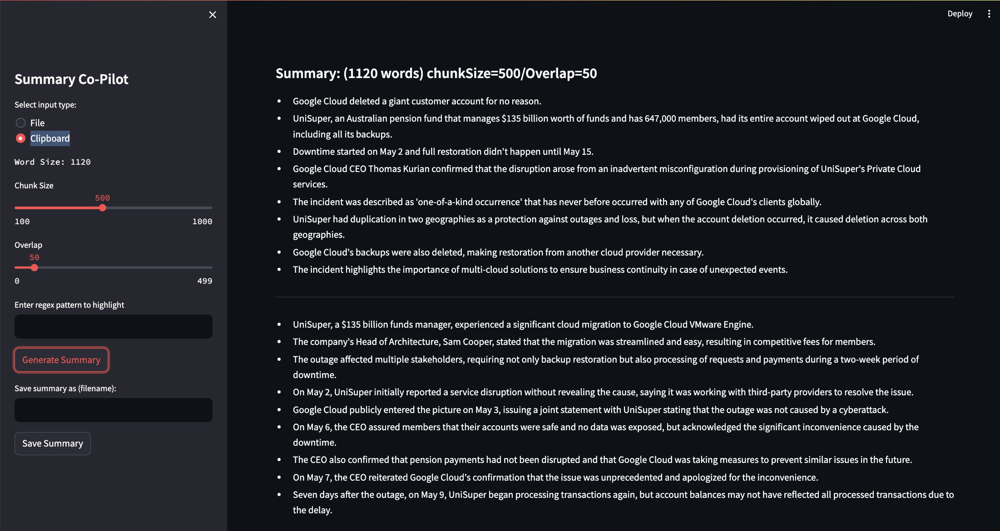

<div align="center">

# LLM text handling
</div>
<div align="center">
    
</div>

These are programs that handle text using LLMs.  We try hard to use quality opensource (e.g. llama3:8b) LLMs first and also paid models where appropriate.

Before running any of the programs, do this:

```bash
python -m env venv
source ./env/bin/activate
pip install -r requirements.txt
export PYTHONPATH=$(pwd)/python
```

Setup an [ollama service](https://github.com/ollama/ollama/blob/ba04afc9a45a095e09e72c1d716fdfe941d9b340/docs/linux.md#adding-ollama-as-a-startup-service-recommended) or get an openai apikey.

NOTE: the summarizers support only ollama with `llama3:8b` for now; please ensure that your ollama API server
is reachable at http://127.0.0.1:11434.  The focus was on a local API server since summarization tends to be
something with sensitive data.

## Text summarizer

Taking inspiration from [infiniteGPT](https://github.com/emmethalm/infiniteGPT) and other chunking methods (e.g., llama-index), we have a text summarizer that can use ollama or openai.  Use ollama for private summarization,
hence the name `osummarize`

Run it like this:

```bash
./python osummarize/osummarize.py
```

## Streamlit text summarizer

Using [streamlit](streamlit.io), we have a summarizer that can be used via a web interface as a "co-pilot" for your text summarization needs.

Run it like this:

```bash
streamlit run --server.port 8509 --server.headless True --theme.base dark sl_summarize/sl_osummary.py
```

Then browse to [localhost:8509](localhost:8509).  You can create multiple tabs with that link so you
can have multiple summarizations.

<div align="center">
    
</div>

## HTML reader

This is an app that can read webpages.  It is quite rudimentary but useful for gathering text from webpages (e.g., for summarization).

Run it like this:

```bash
python/reader/reader.py
```

## Voice conversation chat

Taking inspiration from [this youtube video](https://www.youtube.com/watch?v=B00xo7vzN7w&ab_channel=AIFORDEVS) showing chatgpt4o with whisper and tts-1 model, we make a simple, chat application using a popular chat application coding pattern.  The program makes use of the ollama api and openai tts-1 model.

NOTE: `pip install pyaudio` did not work for me but `conda install pyaudio` did.

Run it like this:

```bash
export OPENAI_API_KEY=sk-... (fill in your API key)
python/voice-chat/voice-chat.py
```

## Type check during development

We add [type hints](https://docs.python.org/3/library/typing.html) in the code so use this
to ensure you comply:

```bash
mypy --install-types ;# You only need to do this once in your venv
```

Do this before committing to ensure you comply:

```bash
$ mypy python/sl_summarize/sl_osummary.py
Success: no issues found in 1 source file

$ mypy python/reader/reader.py
Success: no issues found in 1 source file

$ mypy python/voice-chat/voice_app.py
Success: no issues found in 1 source file

$ mypy python/osummarize/osummarize.py
Success: no issues found in 1 source file
```

or do this to check all in one command:

```bash
make lint
```

If there are exceptions, update the [mypy.ini](./mypy.ini) file accordingly.  But please do so sparingly
as we want to take advantage of typing checking as much as we can.